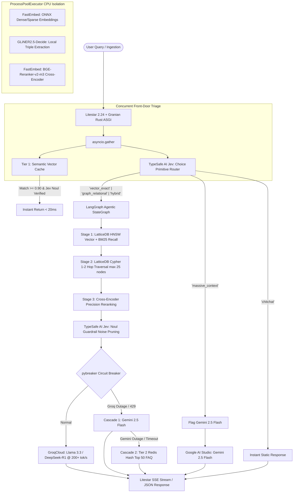

# lattice-rag

[](https://www.python.org/)
[](https://litestar.dev/)
[](https://github.com/emmett-framework/granian)
[](https://github.com/latticedb/latticedb)
[](https://typesafe.ai/)
[](LICENSE)

> **In-process, zero-cloud-cost Hybrid GraphRAG engine and CI/CD evaluation suite.**  
> Built on **LatticeDB**, **Litestar (Rust/Granian)**, **FastEmbed**, **GLiNER2.5-Decide**, and **TypeSafe AI Jev**. Features sub-second multi-hop relational traversal, deterministic System 1 routing, multi-tiered fallback caching, and automated CI/CD regression gates.

---

## 🚀 Overview & 2026 Zero-Cost Architecture

Traditional GraphRAG architectures suffer from heavy JVM database footprints (Neo4j), expensive remote vector stores (Pinecone, Qdrant), and sequential LLM network hops that push query latencies into multiple seconds and incur steep cloud hosting costs.

`lattice-rag` eliminates these bottlenecks through an **entirely in-process, single-binary architecture**:



---

## ✨ Key Architectural Highlights

| Subsystem | Technology | Capability |
|---|---|---|
| **Web Server** | **Granian** | Rust-based HTTP server delivering 2–4x the throughput of standard Uvicorn. |
| **API Framework** | **Litestar 2.24+** | High-performance ASGI framework with native DTOs, dependency injection, and Scalar OpenAPI. |
| **Serialization** | **msgspec** | Rust-backed struct serialization doubling JSON encode/decode performance. |
| **Storage Engine** | **LatticeDB 0.15+** | Embedded SQLite-like property-graph file combining native HNSW vector index (`<=>`) and BM25 text index (`@@`). |
| **Local SLMs** | **FastEmbed + GLiNER** | Quantized ONNX dense/sparse embeddings and local entity-relationship triple extraction on CPU. |
| **Cross-Encoder** | **bge-reranker-v2-m3** | High-precision INT8 ONNX reranker with 8,192 token context window. |
| **System 1 Routing** | **TypeSafe AI Jev** | 70–500ms `Choice` primitive routing + batched `Noul` boolean context noise pruning. |
| **Multi-Tier Cache** | **Vector + Redis Hash** | Tier 1 local semantic vector cache (<20ms); Tier 2 `pybreaker` circuit breaker cascading to Redis Top 50 FAQ. |
| **Primary Synthesis** | **GroqCloud** | Ultra-fast token streaming (200+ tok/s) via `qwen/qwen3.8-27b` with structured citation grounding. |
| **Context Fallback** | **Gemini 3.8 Flash** | Massive context window (>100k tokens) reserved for cross-document synthesis and circuit breaker failover. |
| **CI/CD Quality Gate** | **Jev Score + DeepEval** | Automated 20-query evaluation gate blocking PRs on regression (`Score_PR >= Score_main - 0.03`). |
| **Secret Hygiene** | **Zero-Trust Security** | `SecretStr` masking, log redaction, RFC 9457 error shielding, and automated `apikeys.md` migration. |

---

## 📦 Directory Structure

```
lattice-rag/
├── pyproject.toml               # Python 3.12 dependencies and package configuration
├── README.md                    # Project documentation and quickstart
├── CHANGELOG.md                 # Version history and architectural log
├── LICENSE                      # MIT License
├── .gitignore                   # Strict boundary blocking .env, apikeys.md, and databases
├── .env.example                 # Sanitized configuration template
├── docs/                        # In-depth architectural guides
│   ├── architecture.md          # Multi-layer system architecture
│   ├── security.md              # Zero-trust secret management
│   ├── storage-and-schema.md    # LatticeDB graph and index modeling
│   └── api-reference.md         # Litestar endpoints & DTO contracts
├── src/lattice_rag/
│   ├── config.py                # Environment configuration with SecretStr validation
│   ├── security.py              # Secret masking, log redaction, apikeys migration
│   ├── app.py                   # Litestar application factory & ApplicationCore
│   ├── server.py                # Granian ASGI runner entrypoint
│   ├── cli.py                   # Command-line interface (Click)
│   ├── api/
│   │   ├── dtos.py              # msgspec Structs (camelCase wire contracts)
│   │   └── controllers/         # Query, Ingestion, Cache, and Health controllers
│   ├── storage/
│   │   ├── db.py                # LatticeStore embedded database manager
│   │   └── extract.py           # GLiNER2.5-Decide local triple extraction
│   ├── routing/
│   │   ├── router.py            # TypeSafe AI Jev Choice front-door router
│   │   └── guardrail.py         # TypeSafe AI Jev Noul context pruning
│   ├── caching/
│   │   ├── semantic_cache.py    # Tier 1 Semantic Vector Cache (<20ms)
│   │   └── fallback_cache.py    # Tier 2 pybreaker + Redis Hash top 50 FAQ
│   ├── retrieval/
│   │   ├── embeddings.py        # FastEmbed dense/sparse ONNX models
│   │   ├── vector_search.py     # Stage 1: HNSW vector + BM25 RRF recall
│   │   ├── graph_traversal.py   # Stage 2: Dynamic 1-to-2 hop Cypher traversal
│   │   ├── reranker.py          # Stage 3: Cross-encoder precision reranking
│   │   └── pipeline.py          # 3-Stage hybrid retrieval orchestrator
│   ├── generation/
│   │   ├── groq_synthesizer.py  # Primary Groq streaming generator (qwen/qwen3.8-27b @ 200+ tok/s)
│   │   ├── gemini_fallback.py   # Context fallback generator (gemini-3.8-flash)
│   │   └── chitchat.py          # Instant deterministic conversational handler
│   └── orchestration/
│       ├── pool.py              # Centralized ProcessPoolExecutor for CPU ML tasks
│       ├── state.py             # LangGraph typed PipelineState
│       └── graph.py             # RAGOrchestrator StateGraph pipeline
└── tests/
    ├── unit/                    # 86 Hermetic unit tests (storage, security, config, routing, generation, caching)
    └── integration/             # Live E2E tests (LatticeDB + FastEmbed + Groq + TypeSafe)
```

---

## ⚡ Quickstart

### 1. Prerequisites
- **macOS** or **Linux**
- **Python 3.12** (`/opt/homebrew/bin/python3.12` or system python)
- **Redis** (optional, for Tier 2 fallback cache: `brew install redis && brew services start redis`)

### 2. Environment Setup

Clone the repository and create a Python 3.12 virtual environment:

```bash
git clone https://github.com/samyakmeshram/lattice-rag.git
cd lattice-rag

# Create and activate Python 3.12 venv
python3.12 -m venv .venv
source .venv/bin/activate

# Install dependencies in editable mode
pip install -e ".[dev]"
```

### 3. Configure API Credentials

Copy the environment template:

```bash
cp .env.example .env
chmod 600 .env
```

Edit `.env` and set your credentials:
```bash
# TypeSafe AI Jev (Required in production)
TYPESAFE_API_KEY=your_typesafe_key_here

# GroqCloud (Primary generation at 200+ tok/s)
GROQ_API_KEY=your_groq_key_here

# Google AI Studio (Massive context fallback)
GEMINI_API_KEY=your_gemini_key_here

# Redis (Tier 2 fallback cache)
REDIS_URL=redis://localhost:6379/0
```

> [!TIP]
> **Safe Key Migration Utility:**
> If you have a temporary `apikeys.md` file, run:
> ```bash
> lattice-rag setup-keys
> ```
> This extracts all keys into `.env` with strict `0600` permissions and automatically shreds `apikeys.md` so plaintext secrets never linger.

---

## 💻 CLI Commands

The `lattice-rag` CLI provides end-to-end operational controls:

```bash
# Inspect all available commands
lattice-rag --help

# Migrate temporary apikeys.md into secure .env
lattice-rag setup-keys

# Start the Granian Rust ASGI server on port 8000
lattice-rag serve --host 0.0.0.0 --port 8000

# Execute a query directly via CLI
lattice-rag query "How does LatticeDB combine HNSW and BM25 search?"

# Ingest a text document into the embedded knowledge graph
lattice-rag ingest path/to/document.txt

# Run latency benchmarks on the retrieval pipeline
lattice-rag benchmark

# Run the 20-query CI/CD evaluation gate against baseline
lattice-rag eval --dataset eval_dataset.json --baseline eval_baseline.json
```

---

## 🌐 API & Web Service

Launch the Granian server:

```bash
lattice-rag serve
```

### Core Endpoints

| Method | Endpoint | Description |
|---|---|---|
| `POST` | `/api/v1/query` | Standard JSON query endpoint returning answer, sources, graph path, and latency breakdown. |
| `POST` | `/api/v1/query/stream` | Server-Sent Events (SSE) streaming real-time tokens and stage progress. |
| `POST` | `/api/v1/ingest` | Ingests document text: chunks, computes ONNX embeddings, extracts entities, and commits to LatticeDB. |
| `GET` | `/api/v1/cache/stats` | Telemetry on Tier 1 semantic vector cache hits and Tier 2 circuit breaker status. |
| `GET` | `/health` | Service health, LatticeDB connection state, and API configuration flags. |
| `GET` | `/schema/scalar` | Interactive OpenAPI documentation powered by Scalar. |

---

## 🧪 Testing & Verification

Run the automated test suite across unit and integration suites:

```bash
# Run all unit tests (86 passing in ~5s)
pytest tests/unit/ -v

# Run live E2E integration test (LatticeDB + FastEmbed + Groq + TypeSafe)
pytest tests/integration/test_phase4_e2e.py -v

# Run full suite (87 tests, 100% green, 0 warnings)
pytest tests/ -v
```

All 87 tests execute cleanly with 0 warnings.

---

## 🔒 Security & Secret Hygiene

- **Zero Git Leaks:** `.env`, `apikeys.md`, `*.key`, and `data/*.db` are hard-blocked in `.gitignore`.
- **Masked Runtime Logs:** Keys wrapped in `SecretStr` are masked as `sk-****{last_4}` in all `str()` and `repr()` representations.
- **Log Sanitizer:** `RedactingFilter` regex-scrubs Bearer tokens and API keys from logging outputs.
- **RFC 9457 Error Shielding:** Exception handlers sanitize outbound error responses to ensure auth headers never leak to clients.

---

## 📄 License

This project is licensed under the [MIT License](LICENSE).
