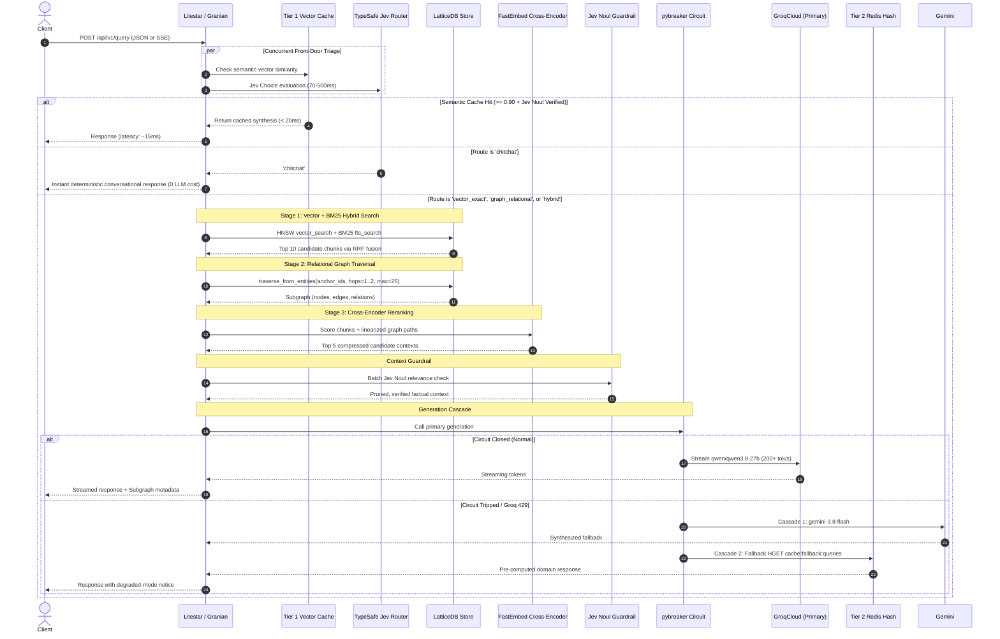

# System Architecture & Technical Design

This document details the architectural principles, subsystems, and execution lifecycle of the **`lattice-rag`** engine.

---

## 1. Design Philosophy: The In-Process Paradigm

Traditional RAG and GraphRAG architectures introduce severe performance and cost bottlenecks:
- **Network Boundaries:** Hitting remote vector databases (Pinecone, Qdrant) over HTTP incurs 30–100ms per search.
- **Heavy Infrastructure Footprint:** JVM-based graph servers (Neo4j) consume gigabytes of memory and require dedicated cloud clusters.
- **Uncontrolled Context Windows:** Shoveling raw retrieved text into frontier LLMs inflates generation costs and increases hallucination surface.

`lattice-rag` adopts an **in-process, single-binary architecture**:
1. All graph nodes, edges, HNSW vector indices, and BM25 inverted indices reside inside a **single local file** (`data/lattice_rag.db`) managed by **LatticeDB**.
2. All embeddings and entity extractions run locally on **CPU** using quantized ONNX models via **FastEmbed** and **GLiNER2.5-Decide**.
3. Small, calibrated "System One" decision models (**TypeSafe AI Jev**) act as front-door traffic controllers and context guardrails, reducing token expenditures.

---

## 2. End-to-End Query Execution Lifecycle

The following sequence diagram illustrates the lifecycle of a user query through the system:

---

## 3. Subsystem Breakdown

### 3.1 Web Server & API Layer (Litestar + Granian + msgspec)
- **Granian ASGI Server:** Multi-threaded Rust HTTP engine running on Python 3.12 without the overhead of standard Python web servers.
- **Litestar Framework:** Employs explicit parameter markers (`JSONBody`, `FromQuery`, `FromPath`) and DTO architectures.
- **msgspec Structs:** All request/response schemas use strict `msgspec.Struct` with `rename="camel"`, outperforming Pydantic by 2–4x in serialization speed.
- **Interactive Documentation:** Native **Scalar** OpenAPI interface rendered directly at `/schema/scalar`.

### 3.2 System 1 Decision Routing (TypeSafe AI Jev)
Instead of invoking large generative models for intent recognition, `lattice-rag` uses **TypeSafe AI Jev**:
- **Front-Door Router (`routing/router.py`):**
  Uses the `Choice` primitive to classify queries into:
  - `vector_exact`: Direct factual lookups and code definitions.
  - `graph_relational`: Questions requiring multi-step relational hops across entities.
  - `hybrid`: Broad semantic queries needing both text context and relational graph structure.
  - `chitchat`: Greetings and pleasantries.
  - `massive_context`: Cross-corpus summarizations requiring 1M token analysis.
- **Context Guardrail (`routing/guardrail.py`):**
  Uses the boolean `Noul` primitive to batch-score retrieved chunks against the user query, pruning irrelevant or tangential passages to eliminate hallucination.

### 3.3 Storage Engine (LatticeDB)
- Embedded single-file property-graph engine (`data/lattice_rag.db`).
- **Unified Querying:**
  - HNSW vector similarity search (`<=>` operator) across 384-dimensional dense vectors.
  - BM25 full-text inverted index (`@@` operator) on text content.
  - Sub-millisecond graph traversals using native C bindings.

### 3.4 3-Stage Hybrid Retrieval Pipeline
1. **Stage 1 (Vector Candidate Recall):** FastEmbed computes the query embedding; LatticeDB executes HNSW vector search and BM25 search concurrently, combining results via Reciprocal Rank Fusion (RRF).
2. **Stage 2 (Relational Traversal):** Identifies entity anchors from Stage 1 chunks and executes dynamic 1-to-2 hop Cypher traversal (budget-capped at 25 nodes to ensure sub-second latency).
3. **Stage 3 (Precision Reranking):** FastEmbed runs a CPU-quantized Cross-Encoder (`bge-reranker-v2-m3`) scoring combined text chunks and linearized graph triples (`[Entity A] -> [RELATION] -> [Entity B]`) to isolate the definitive top 5 chunks.

### 3.5 Multi-Tier Caching & Circuit Breaker
- **Tier 1 (Semantic Vector Cache):** Evaluates incoming query against in-memory query embeddings. If cosine similarity $\ge 0.90$, Jev's `Noul` primitive verifies semantic equivalence, returning the response in under 20ms.
- **Tier 2 (Circuit Breaker & Redis Hash Fallback):** `pybreaker` monitors Groq API calls (fail max=3, reset=30s). On failure or rate-limiting, it cascades to Google Gemini 3.8 Flash, then to a pre-computed Redis hash map (`cache:fallback:queries`) of the top 50 domain queries.

### 3.6 CPU Isolation via ProcessPoolExecutor
To prevent ONNX embeddings and GLiNER extraction from blocking Litestar's asynchronous event loop, all intensive CPU tasks are strictly isolated in a dedicated `ProcessPoolExecutor` via `run_in_pool()`.
