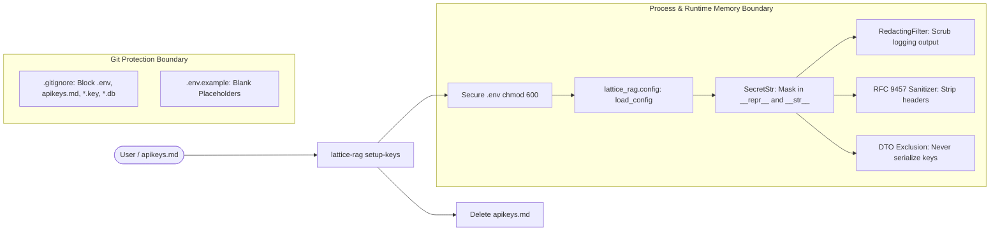

# Secret Security & Sensitivity Architecture

`lattice-rag` enforces a zero-trust credential security architecture to guarantee that API keys, authentication tokens, and private connection strings are never exposed in logs, error payloads, terminal outputs, or version control.

---

## 1. Multi-Layer Security Boundary



---

## 2. Git & Filesystem Hygiene

### 2.1 Git Boundary Protection
The `.gitignore` file enforces that secrets and database files can never be committed:
```gitignore
# Secrets and Environment Variables
.env
.env.*
!.env.example
apikeys.md
*.pem
*.key
secrets/

# Embedded Databases & Cache
data/
*.db
*.db-*
*.latticedb
```

A sanitized template (`.env.example`) is checked into git with documented variable names and blank values.

### 2.2 Automated Credential Migration (`setup-keys`)
Storing API keys in plain text files like `apikeys.md` is a common credential exposure hazard.

`lattice-rag` provides an automated, secure migration utility:
```bash
lattice-rag setup-keys
```

**What it does:**
1. Reads `apikeys.md` if present.
2. Extracts recognized keys (`TYPESAFE_API_KEY`, `GROQ_API_KEY`, `GEMINI_API_KEY`, `REDIS_URL`).
3. Writes them to `.env`.
4. Sets the filesystem permissions on `.env` to `0600` (read/write only by the current OS user):
   ```python
   dotenv_path.chmod(0o600)
   ```
5. Securely shreds/deletes `apikeys.md` so no plaintext secret file lingers on disk.

---

## 3. Runtime & Memory Protection

### 3.1 `SecretStr` Type
API keys are never stored as plain strings in memory configurations. They are wrapped in `SecretStr`:

```python
from lattice_rag.security import SecretStr

key = SecretStr("sk-live_9876543210abcdef")

# __str__ and __repr__ return masked representations:
print(str(key))   # 'sk-****cdef'
print(repr(key))  # "SecretStr('sk-****cdef')"

# Raw access requires explicit call:
raw = key.get_secret_value()
```

Supported mask patterns:
- `sk-****{last_4}` (OpenAI, TypeSafe)
- `gsk_****{last_4}` (Groq)
- `AIza****{last_4}` (Google Gemini)
- `[REDACTED]` (General secrets)

### 3.2 Logging Redaction Filter
The `RedactingFilter` intercepts all log records emitted by `logging` and `structlog`:
```python
class RedactingFilter(logging.Filter):
    REDACT_PATTERN = re.compile(
        r"(?:sk-[a-zA-Z0-9_-]+|gsk_[a-zA-Z0-9_-]+|AIza[a-zA-Z0-9_-]+|Bearer\s+[a-zA-Z0-9_.-]+|token=[a-zA-Z0-9_.-]+)"
    )
```
Any accidental logging of request headers, bearer tokens, or query strings has credentials automatically replaced with `[REDACTED]`.

### 3.3 RFC 9457 Error Shielding
When third-party APIs (Groq, Gemini, TypeSafe) return errors or connection timeouts, `sanitize_error_detail()` scrubs all outbound headers, connection strings, and authorization tokens before emitting problem details to clients.

### 3.4 Process-Level Isolation
Secrets are loaded strictly into memory from `.env` via `python-dotenv` at process startup. They are **never** passed as CLI arguments, preventing exposure in system process tables (`ps aux`) to other OS users.

---

## 4. CI/CD Protection
- **No Hardcoded Keys in CI:** Pull requests and automated eval workflows inject credentials via GitHub Actions Repository Secrets (`${{ secrets.TYPESAFE_API_KEY }}`).
- **Secret Scanning Gate:** Automated scanners (`gitleaks`) run on every PR to verify that no credentials or private keys have been committed.
