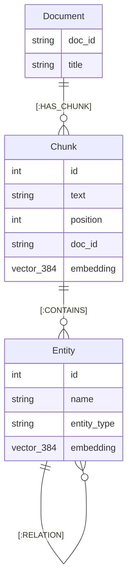

# Storage Engine & Graph Schema (LatticeDB)

`lattice-rag` uses **LatticeDB** (v0.15+), an embedded, serverless, single-file property-graph database. It acts as an in-process SQLite for connected graph, vector, and full-text data.

---

## 1. Graph Data Model

The graph follows a **Hierarchical Document-Chunk-Entity** architecture:



### Node Labels & Properties

| Label | Properties | Description |
|---|---|---|
| `:Document` | `doc_id` (str), `title` (str) | Top-level document container. |
| `:Chunk` | `text` (str), `position` (int), `doc_id` (str), `embedding` (vector[384]) | Text segment with dense ONNX embedding and BM25 index. |
| `:Entity` | `name` (str), `entity_type` (str), `embedding` (vector[384]) | Extracted semantic entity (e.g. `LatticeDB`, `FastEmbed`). |

### Edge Relationships

| Edge | Source $\to$ Target | Properties | Purpose |
|---|---|---|---|
| `HAS_CHUNK` | `:Document` $\to$ `:Chunk` | — | Preserves document hierarchy and reading order. |
| `CONTAINS` | `:Chunk` $\to$ `:Entity` | — | Grounding link tying entities to their exact source passage. |
| `RELATION` | `:Entity` $\to$ `:Entity` | `type` (str) | Semantic multi-hop relationship extracted by GLiNER. |

---

## 2. Indices & Search Operations

LatticeDB supports three native search modalities in a single file:

### 2.1 HNSW Vector Similarity Search
Chunks and entities have 384-dimensional dense vectors generated by FastEmbed (`BAAI/bge-small-en-v1.5`).

- **Querying:**
  ```python
  raw_results = db.vector_search(query_embedding, k=10)
  ```
  Returns `List[VectorSearchResult]` with `node_id` and L2 distance in sub-millisecond time.
- **Scoring:** Converted to similarity via:
  $$\text{Score} = \frac{1}{1 + \text{distance}}$$

### 2.2 BM25 Full-Text Inverted Index
Configured during database initialization:
```python
db.create_node_fts_index("Chunk", "text")
db.create_node_fts_index("Entity", "name")
```
- **Querying:**
  ```python
  raw_results = db.fts_search("Chunk", "text", query_text, limit=10)
  ```
  Returns BM25-ranked relevance scores for exact keyword and term matching.

### 2.3 Reciprocal Rank Fusion (RRF)
Vector similarity and BM25 search results are fused using standard RRF ($k=60$):
$$\text{RRF}(d) = \sum_{m \in \{\text{vector}, \text{bm25}\}} \frac{1}{60 + \text{rank}_m(d)}$$

---

## 3. Transaction & Commit Semantics

> [!IMPORTANT]
> **Explicit Commit Requirement:**  
> In LatticeDB, write transactions (`with db.write() as txn:`) **default to rollback on context exit**. You must explicitly invoke `txn.commit()` before exiting the block:

```python
with db.write() as txn:
    doc = txn.create_node(labels=["Document"], properties={"doc_id": "1", "title": "Guide"})
    chunk = txn.create_node(labels=["Chunk"], properties={"text": "Content", "position": 0})
    txn.set_vector(chunk.id, "embedding", embedding_array)
    txn.create_edge(doc.id, chunk.id, "HAS_CHUNK")
    
    # CRITICAL: Commit transaction
    txn.commit()
```

---

## 4. Multi-Hop Relational Traversal

Multi-hop graph traversal pivots from Stage 1 entity anchors through `RELATION` edges:

```python
subgraph = store.traverse_from_entities(
    entity_ids=[anchor_id],
    max_hops=2,      # 1 hop for factual queries, 2 for relational
    budget=25        # Hard limit to guarantee < 1s latency
)
```

The traversal uses native C bindings (`txn.get_outgoing_edges()` and `txn.get_edge_property()`) to expand nodes along relationship paths in microseconds.
